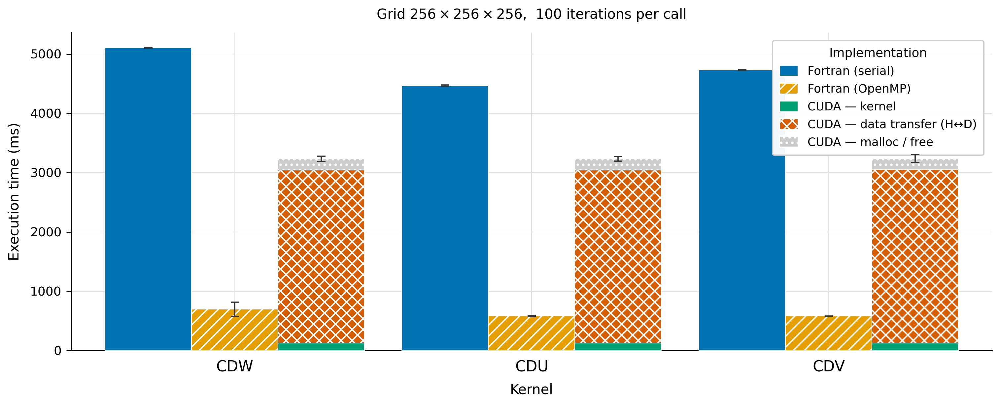

# Automatic GPU Offloading of Fortran Stencil Kernels

A source-to-source compiler that translates annotated Fortran stencil modules into
CUDA and C++ implementations, together with a comprehensive benchmark suite and a
proof-of-concept framework for transparent lazy GPU memory management.

The project demonstrates that serial Fortran stencil code can be automatically
offloaded to a GPU — with the generated kernel running **~50× faster** than serial
Fortran — and identifies host↔device data transfer as the dominant remaining
bottleneck, motivating the memory framework work.

---

## Repository Structure

```
fortran-abomination/
│
├── compiler/               ← source-to-source compiler (Python package)
│   └── README.md           ← full compiler documentation
│
├── fortran-stencils/       ← annotated Fortran input files for the compiler
│   ├── elmm_cdu.f90        ← zonal momentum advection (U)
│   ├── elmm_cdw.f90        ← vertical momentum advection (W)
│   └── elmm_cdv.f90        ← meridional momentum advection (V)
│
├── benchmarks/             ← full benchmark suite (5 variants × 3 kernels)
│   └── README.md           ← build, run, test, and plotting documentation
│
├── memory-framework/       ← proof-of-concept: transparent lazy GPU memory
│   └── README.md           ← concept, state machine, and PoC documentation
│
├── requirements.txt        ← Python dependencies (fparser, matplotlib)
└── README.md               ← this file
```

---

## Setup

```bash
# 1. Create and activate a virtual environment
python -m venv venv
source venv/bin/activate

# 2. Install Python dependencies
pip install -r requirements.txt
```

Hardware requirements for the full benchmark suite:

| Component | Requirement |
|-----------|-------------|
| Fortran compiler | gfortran 10+ (or equivalent) |
| C++ compiler | g++ 10+ with C++17 |
| GPU + CUDA | CUDA Toolkit 11+ and `nvcc` on `PATH` (CUDA variants only) |
| OpenMP | supported by the Fortran/C++ compiler (OMP variants) |

---

## Quick Start

### 1 — Compile a Fortran kernel to CUDA + C++

The compiler reads an annotated Fortran module and generates three files: a CUDA
kernel, a plain C++ kernel, and a Fortran `iso_c_binding` wrapper.

```bash
# Generate all output files for the CDU momentum kernel
python -m compiler \
    --input  fortran-stencils/elmm_cdu.f90 \
    --kernel CDU \
    --output-dir out/

# Output:
#   out/generated_code.cu         ← CUDA __global__ kernels + host wrapper
#   out/generated_cpp_impl.cpp    ← plain C++ (same algorithm, no GPU)
#   out/generated_interface.f90   ← Fortran iso_c_binding wrapper module
#   out/common_functions.cuh      ← shared indexing + timing header
```

The Fortran kernel is preserved exactly: the entry subroutine keeps its name and
signature.  No changes to the calling Fortran code are required.

See [`compiler/README.md`](compiler/README.md) for the full CLI reference, input
file format, and architecture description.

### 2 — Regenerate all benchmark sources

The `CPP`, `CPP-OMP`, and `CUDA` benchmark variants use files produced by the
compiler.  To regenerate them all from the Fortran originals:

```bash
python benchmarks/generate_all_sources.py

# Per-case output:
#   benchmarks/CDU/CUDA/generated_code.cu
#   benchmarks/CDU/CUDA/cdu.f90          ← Fortran interface
#   benchmarks/CDU/CPP-OMP/generated_cpp_impl.cpp
#   benchmarks/CDU/CPP/generated_cpp_impl.cpp   ← #pragma omp lines stripped
#   ... (same for CDW, CDV)
```

### 3 — Build and run a single benchmark

```bash
# Serial Fortran, default 64×64×64 grid
make -C benchmarks CASE=CDU VARIANT=Fortran
./benchmarks/bin/CDU_Fortran_NX64_NY64_NZ64_NITER100_NWARMUP5/benchmark

# CUDA, 256×256×256 grid
make -C benchmarks CASE=CDU VARIANT=CUDA NX=256 NY=256 NZ=256 CUDA_ARCH=sm_80
./benchmarks/bin/CDU_CUDA_NX256_NY256_NZ256_NITER100_NWARMUP5/benchmark
```

### 4 — Run the full benchmark sweep → CSV

```bash
cd benchmarks
python run_bechmarks.py > results.csv   # progress on stderr, clean CSV on stdout
```

### 5 — Run correctness tests

```bash
cd benchmarks
python run_tests.py        # all three cases
python run_tests.py CDU    # single case
```

Expected output:

```
=== CDU ===
  [REF ] Fortran         4096 values
  [PASS] Fortran-OMP     max_abs_diff=0.000e+00  (tol=1e-10)
  [PASS] CPP             max_abs_diff=0.000e+00  (tol=1e-10)
  [PASS] CPP-OMP         max_abs_diff=0.000e+00  (tol=1e-10)
  [PASS] CUDA            max_abs_diff=0.000e+00  (tol=1e-10)

All tests PASSED.
```

### 6 — Generate figures

```bash
cd benchmarks
python graphs/plot_benchmarks.py
# → graphs/figs/grid_256x256x256_niter100.{png,pdf}
```

---

## Key Results

Benchmarks were run on a 256×256×256 grid, 100 timed iterations per call.

| Variant | CDU (ms) | CDW (ms) | CDV (ms) | Speedup vs Fortran |
|---------|----------|----------|----------|--------------------|
| Fortran (serial) | 4 498 | 5 122 | 4 749 | 1× (reference) |
| C++ (serial) | 4 531 | 5 108 | 4 786 | ~1× |
| Fortran-OMP | 568 | 643 | 596 | ~8× |
| C++-OMP | 580 | 643 | 589 | ~8× |
| **CUDA kernel only** | **128** | **128** | **127** | **~38×** |
| CUDA total (incl. transfers) | 3 232 | 3 231 | 3 260 | ~1.5× |

The CUDA kernel achieves a **~38× speedup** over serial Fortran.  However,
host↔device memory transfers consume ~94% of the total CUDA wall-clock time,
reducing the observable end-to-end speedup to only ~1.5×.  This motivates the
memory framework work described below.



---

## Components

### `compiler/` — Source-to-Source Compiler

A Python package (`python -m compiler`) built on the `fparser` library.  Parses
Fortran modules annotated with `! kernels` / `! kernel` comments, extracts the
kernel call graph, groups do-loop nests for fusion, and emits:

- **CUDA** — each do-loop group becomes a `__global__` kernel; the host wrapper
  handles memory allocation, H→D upload, kernel launch, D→H download.
- **C++ (with/without OpenMP)** — all sub-kernels inlined into a single flat
  function; the `#pragma omp` line is present in the OMP variant and stripped for
  the plain CPP variant.
- **Fortran interface** — `iso_c_binding` module that exposes the C function under
  the original Fortran subroutine name, keeping every call site unchanged.

→ Full documentation: [`compiler/README.md`](compiler/README.md)

### `benchmarks/` — Benchmark Suite

Five implementation variants of three momentum-advection stencil kernels (CDU,
CDW, CDV), driven by a unified GNU Make build system.  Includes:

- Automated runner (`run_bechmarks.py`) that sweeps grids, builds on demand, and
  writes structured CSV output.
- Correctness test runner (`run_tests.py`) with deterministic inputs and
  element-wise comparison against the serial Fortran reference.
- Publication-quality figure generator (`graphs/plot_benchmarks.py`) using the
  Wong (2011) colorblind-safe palette.
- `generate_all_sources.py` — regenerates all CUDA/C++ sources from the Fortran
  originals via the compiler.

→ Full documentation: [`benchmarks/README.md`](benchmarks/README.md)

### `memory-framework/` — Lazy GPU Memory Management (PoC)

The benchmark results expose that memory transfers, not computation, are the
bottleneck.  This component explores a transparent solution: instead of changing
how Fortran allocates memory, the framework uses `mprotect(2)` to withdraw the
process's own access rights to GPU-owned pages.  Any Fortran read or write then
raises `SIGSEGV`, which a custom handler intercepts to perform the lazy transfer
and restore access — entirely invisibly to the Fortran code.

The `proof-of-concept/` subdirectory demonstrates the mechanism without CUDA
using a simple integer-doubling computation.

→ Full documentation: [`memory-framework/README.md`](memory-framework/README.md)

### `fortran-stencils/` — Input Kernels

Three annotated Fortran source files that serve as the canonical inputs to the
compiler and the reference implementations in the benchmark suite.  Each
implements one component of a momentum-advection operator used in atmospheric
modelling.

---

## Input File Format (Summary)

The compiler requires the Fortran source to follow a simple convention:

```fortran
! kernels                      ← first line: marks this file for the compiler
module MomentumAdvection
  implicit none
  private
  public CDU

contains

  ! kernel                     ← marks each subroutine to be compiled
  subroutine set(arr, val, Unx, Uny, Unz)
    real(knd), contiguous, intent(out) :: arr(:,:,:)
    integer, intent(in) :: Unx, Uny, Unz
    ...
  end subroutine

  ! kernel
  subroutine CDU(U2, U, V, W, dxmin, dymin, dzmin, Unx, Uny, Unz)
    ! entry point — calls set, CDUdiv, CDUadv, multiply
    call set(U2, 0.0_knd, Unx, Uny, Unz)
    call CDUdiv(...)
    call CDUadv(...)
  end subroutine CDU

end module
```

The entry kernel is specified via `--kernel CDU`; the compiler inlines all
transitively called `! kernel` subroutines automatically.

---

## VS Code

A launch configuration at `.vscode/launch.json` provides a **Run compiler
package** target that runs `python -m compiler` from the workspace root with
full debugger support.  Select it in the Run and Debug panel.
