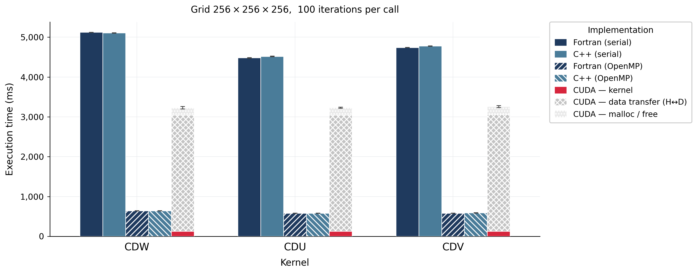

# Lazy GPU Memory Framework

A proof-of-concept for **transparent, demand-driven GPU memory management** for
Fortran programs — implemented entirely in C++ without modifying a single line of
Fortran source code.

---

## Table of Contents

1. [Motivation](#1-motivation)
2. [The Core Idea](#2-the-core-idea)
3. [Memory State Machine](#3-memory-state-machine)  
   3.1 [States](#31-states)  
   3.2 [Transitions by access pattern](#32-transitions-by-access-pattern)
4. [Implementation Mechanism](#4-implementation-mechanism)
5. [Proof of Concept](#5-proof-of-concept)
6. [API Sketch (`include/`)](#6-api-sketch-include)
7. [Limitations and Future Work](#7-limitations-and-future-work)

---

## 1. Motivation

Across all three stencil kernels (CDU, CDW, CDV) the GPU computation itself is
extremely fast, but the data movement between CPU and GPU dwarfs it by an order
of magnitude.



At a 256×256×256 grid with 100 iterations per call, host↔device data transfers
alone consume roughly **22 900 ms** out of ~25 100 ms total CUDA time, while the
kernel itself takes only **~1 050 ms**.  The GPU kernel is ~40–60× faster than
serial Fortran per call, yet the end-to-end speedup is only ~2× because data
must cross the PCIe bus on every kernel invocation.

The root cause is simple: **Fortran owns the arrays**.  Before calling the GPU
kernel, the runtime must copy every input array from CPU RAM to GPU VRAM; after
the kernel finishes, it must copy the output array back so Fortran can read it.
This happens unconditionally on every call, regardless of whether Fortran will
actually read the output at all.

CUDA does offer a solution — *Unified Memory* (`cudaMallocManaged`) — but it
requires the Fortran allocations to be replaced with special CUDA-managed ones.
That either means rewriting the Fortran source, or generating wrapper code that
allocates memory differently for the GPU variant.  Neither is truly transparent.

---

## 2. The Core Idea

The approach works on top of ordinary Fortran `allocate` calls, with no changes
to Fortran source.

The CPU operating system gives every process fine-grained control over which
memory pages it is allowed to access.  By temporarily
**withdrawing the process's own access rights** to the pages belonging to a GPU
buffer, we turn any Fortran read or write into a `SIGSEGV` — a catchable signal.
A custom signal handler intercepts the fault, performs whatever lazy operation is
needed (upload, download, sync), restores access, and returns.  Execution
continues exactly where it left off.  Fortran never knows anything happened.

```
Normal flow (no framework)
──────────────────────────
  Fortran allocate → CPU pages → ... Fortran writes ... → cudaMemcpy H→D
  → kernel → cudaMemcpy D→H → Fortran reads (always, unconditionally)

With lazy framework
───────────────────
  Fortran allocate → CPU pages → arm_memory_locks()
                                 ↓ mprotect: reads allowed, writes trapped (input)
                                 ↓ mprotect: all access trapped (output)

  [Fortran reads input]   → allowed, no trap fired
  [GPU kernel runs]       → output stays on GPU, CPU pages remain locked
  [Fortran reads output]  → SIGSEGV → handler: pull D→H, unlock page, resume
  [Fortran never reads]   → no transfer ever happens — zero cost
```

The result is a **lazy, pull-on-demand** model.  A data transfer happens only at
the moment when Fortran actually touches the data, and only in the direction that
is actually needed.

---

## 3. Memory State Machine

Each tracked buffer is at any moment in exactly one of the following states.

### 3.1 States

```
┌───────────────────┐
│  CPU_ONLY         │  Initial state. Memory allocated by Fortran. No GPU copy.
│  (prot: R/W)      │  Full read/write access for Fortran.
└───────────────────┘

┌───────────────────┐
│  CPU_LOCKED_INPUT │  Buffer contains input data for the GPU kernel.
│  (prot: READ)     │  Fortran may read freely. Any write triggers the handler.
│                   │  GPU copy: up to date (or not yet allocated).
└───────────────────┘

┌───────────────────┐
│  GPU_CURRENT      │  GPU holds the authoritative copy.
│  (prot: NONE)     │  CPU pages fully locked. On a Fortran READ, the handler
│                   │  pulls D→H then unlocks. On a Fortran WRITE, the handler
│                   │  just unlocks — no transfer, GPU copy is discarded.
└───────────────────┘

┌───────────────────┐
│  CPU_DIRTY        │  Fortran has written new data on the CPU.
│  (prot: R/W)      │  GPU copy is stale. An H→D transfer must happen before
│                   │  the next GPU kernel launch.
└───────────────────┘

┌───────────────────┐
│  SYNCHRONIZED     │  Both CPU and GPU hold identical data.
│  (prot: READ)     │  Fortran may read. Any write transitions to CPU_DIRTY.
│                   │  GPU kernel may also read without re-upload.
└───────────────────┘
```

---

## 4. Implementation Mechanism

The framework relies on two standard POSIX/Linux kernel features:

### `mprotect(2)` — page-granular access control

```c
mprotect(void* addr, size_t len, int prot);
```

Sets access permissions on a range of memory pages.  Permissions are:

| `prot` value              | Effect                                                   |
| ------------------------- | -------------------------------------------------------- |
| `PROT_READ \| PROT_WRITE` | Normal read/write access                                 |
| `PROT_READ`               | Reads allowed; any write raises `SIGSEGV`                |
| `PROT_NONE`               | All access forbidden; any read or write raises `SIGSEGV` |

The granularity is one OS page (typically 4 096 bytes).  The framework rounds
buffer boundaries outward to page boundaries before calling `mprotect`, so the
protection always covers the entire allocation.

### `sigaction(2)` + `SA_SIGINFO` — the trap handler

```c
struct sigaction sa;
sa.sa_flags = SA_SIGINFO;        // pass siginfo_t so we know the fault address
sa.sa_sigaction = segv_handler;
sigaction(SIGSEGV, &sa, NULL);
```

When a protected page is accessed, the OS delivers `SIGSEGV` to the process.  The
handler receives the faulting address via `siginfo_t::si_addr`.  The handler:

1. Checks which buffer (input or output) the faulting address belongs to.
2. If neither — re-raises the signal (genuine crash).
3. Calls `mprotect(..., PROT_READ|PROT_WRITE)` to restore access on both pages.
4. Executes the lazy work (in the real implementation: the appropriate `cudaMemcpy`
   and state transition; in the proof-of-concept: a simple integer doubling).
5. Returns from the handler — the OS re-executes the faulting instruction, which
   now succeeds.

This is signal-safe: steps 3 and 4 are performed after unlocking the page, so the
lazy work runs with normal memory access semantics.

---

## 5. Proof of Concept

`proof-of-concept/` contains a self-contained demonstration of the mechanism
without any CUDA dependency.  It replaces the GPU computation with a trivial
"double every element" operation to keep the focus on the memory-protection
machinery.

### Files

| File              | Purpose                                                                                                        |
| ----------------- | -------------------------------------------------------------------------------------------------------------- |
| `managed_mem.cpp` | `arm_memory_locks()` implementation: sets up page protections and registers the `SIGSEGV` handler              |
| `main.f90`        | Fortran program that allocates two arrays, calls `arm_memory_locks`, then performs one of four access patterns |
| `Makefile`        | Builds the mixed Fortran/C++ binary; pass `ARGS=N` to choose the test case                                     |

### How to build and run

```bash
cd proof-of-concept
make          # builds ./pure_fortran_app
make ARGS=1   # run test case 1
```

### Test cases

The Fortran program accepts a single command-line argument (1–4) that selects
which access to perform after arming the locks.  This isolates each trap scenario:

| Case | Fortran action           | What happens                                                                                                                                                                                                                                    |
| ---- | ------------------------ | ----------------------------------------------------------------------------------------------------------------------------------------------------------------------------------------------------------------------------------------------- |
| `1`  | Read `in_arr(1)`         | **No trap.** `in_arr` is `PROT_READ`; reads are allowed freely. Returns `15`.                                                                                                                                                                   |
| `2`  | Write `in_arr(1) = 999`  | **Trap fires.** Write to `PROT_READ` page raises `SIGSEGV`. Handler unlocks both pages and computes the doubling (simulating an H→D re-upload trigger). After the handler, the write succeeds. `out_arr` now holds the doubled original values. |
| `3`  | Read `out_arr(1)`        | **Trap fires.** `out_arr` is `PROT_NONE`; any access raises `SIGSEGV`. Handler unlocks and runs the doubling (simulating D→H). Returns `30` (= 15 × 2).                                                                                         |
| `4`  | Write `out_arr(1) = 888` | **Trap fires.** Same trap as case 3. Handler unlocks and runs doubling for `out_arr(2)` onwards; `out_arr(1)` is then overwritten to `888` by Fortran.                                                                                          |

### Expected output for case 3

```
[C++ HOOK] Trap triggered at memory address: 0x...
[C++ HOOK] Executing lazy doubling NOW!
--- TEST 3: Reading Output ---
Action: Reading out_arr(1)
Result:  30
Result: out_arr(2) =  60
Expected: Hook fired. Result is 30.
```

Fortran code that triggers this is completely unmodified — it is a plain array
read:

```fortran
print *, out_arr(1)   ! raises SIGSEGV → handler fires → D→H → value appears
```

### Memory layout after `arm_memory_locks`

```
  in_arr  ──►  [ 15 | 30 | ... ]    prot = PROT_READ
                                     reads:  OK
                                     writes: SIGSEGV → handler

  out_arr ──►  [  0 |  0 | ... ]    prot = PROT_NONE
                                     reads:  SIGSEGV → handler
                                     writes: SIGSEGV → handler
```

---

## 6. API Sketch (`include/`)

`include/mem_guard.hpp` contains the beginning of the production API.  It is
incomplete and will evolve as the requirements become clearer during the full
implementation.  The current sketch establishes the core data structures and
method signatures:

```cpp
namespace mem_guard {

struct BufferRecord {
    void*  host_ptr;       // Fortran-allocated CPU address
    void*  gpu_ptr;        // cudaMalloc'd GPU address
    size_t size_in_bytes;
};

class GpuMemGuard {
  public:
    // Query
    template<typename T> bool  is_on_gpu(const T* buffer) const;
    template<typename T> T*    get_gpu_address(const T* buffer) const;

    // Explicit transfers
    template<typename T> void  move_to_gpu(const T* buffer, size_t num_items);
    template<typename T> void  move_to_gpu(const T* buffer);   // re-upload
    template<typename T> void  move_to_host(const T* buffer);  // D→H

    // Protection control (called by the SIGSEGV handler)
    template<typename T> void  protect_from_read_writes(const T* item); // PROT_NONE
    template<typename T> void  protect_from_writes(const T* item);      // PROT_READ
    template<typename T> void  unprotect(const T* item);                // PROT_RW

  private:
    std::vector<BufferRecord> buffer_records;
};

extern GpuMemGuard gpu_mem_guard;  // process-wide singleton

}
```

The intended usage from the generated C++ wrapper (the code that currently does
the unconditional `cudaMemcpy`) would look like:

```cpp
// Instead of: cudaMemcpy(d_u, u, bytes, H2D); ... kernel <<<...>>>;
//             cudaMemcpy(u2, d_u2, bytes, D2H);

// Setup (once, when Fortran first calls the kernel):
gpu_mem_guard.move_to_gpu(u, total_elements);     // initial upload
gpu_mem_guard.protect_from_writes(u);             // lock against CPU writes
gpu_mem_guard.protect_from_read_writes(u2);       // lock against all CPU access

// On each kernel call:
if (cpu_dirty(u))  gpu_mem_guard.move_to_gpu(u);  // re-upload only if changed
launch_kernel(gpu_mem_guard.get_gpu_address(u),
              gpu_mem_guard.get_gpu_address(u2));  // kernel works in GPU memory

// u2 stays on GPU with PROT_NONE. No D→H unless Fortran actually reads it.
```

---

## 7. Limitations and Future Work

### Known limitations

**Page granularity**  
`mprotect` operates at page boundaries (typically 4 096 bytes).  If two different
arrays happen to share a page — possible for small arrays or at allocation
boundaries — a trap targeting one will also unlock the other.  The handler must
check which buffer owns the faulting address and handle each independently.

**Signal handler re-entrancy**  
`SIGSEGV` delivered inside a signal handler is typically fatal unless
`SA_NODEFER` is set and the handler is carefully written to be re-entrant.  In the
current proof-of-concept the handler immediately calls `mprotect` to unlock the
page before doing any further work, which avoids the re-entrancy problem for the
common case.

**Other signal handlers**  
MPI, OpenMP runtimes, and some profilers register their own `SIGSEGV` handlers.
The framework must chain to the previous handler for faults that do not belong to
any tracked buffer.  The current implementation calls `_Exit(1)` for unknown
faults, which is safe for the proof-of-concept but must be replaced in production.

**Thread safety**  
`mprotect` affects all threads sharing the address space.  A multi-threaded Fortran
program (e.g. OpenMP) could have multiple threads trigger the handler simultaneously.
The handler must be made thread-safe (a mutex, or per-page atomic state flags) in
the production implementation.

**GPU ↔ CPU coherence in the handler**  
A real `cudaMemcpy` call inside a signal handler is not officially supported by
CUDA.  The production implementation may need to defer the actual transfer to a
helper thread and have the handler spin-wait for it, keeping the faulting thread
suspended until the data arrives.

### Intended future work

- Complete the `GpuMemGuard` class with full state-machine enforcement.
- Integrate the state machine into the generated CUDA wrapper produced by the
  `fort_to_cuda` compiler so existing benchmarks can opt in to lazy memory
  management with a single flag.
- Benchmark the lazy scheme against the current eager `cudaMemcpy` approach on the
  CDU/CDW/CDV stencils to quantify the improvement in time-stepping workloads
  where outputs are consumed by the very next GPU kernel call.
- Investigate whether `userfaultfd(2)` provides a safer alternative to `SIGSEGV`
  hooking for the transfer-on-access mechanism.
